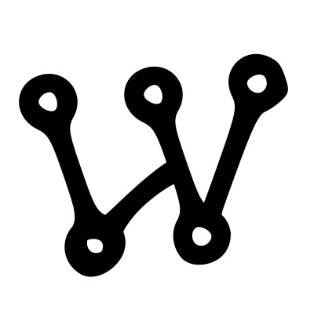

<h1 align="center" style="color: #C792EA; font-size: 3em; font-family: 'Teko', monospace;">
  <b>Hi👋, I'm Iron Wolf</b>
</h1>

<h2 align="center" style="color: #7FDBCA; font-family: 'Teko', monospace; font-size: 2.3rem;">
  Junior Electronics & Communications Engineering Student
</h2>

  

  I am passionate about hardware and software development, and have hands-on experience in Arduino, Python, and web development (HTML and CSS) yet I am still a beginner. I have worked on several projects including the Iron Man portfolio site, an Ohm color code calculator app, and small Python projects. I have also explored AI and machine learning through projects such as face recognition and deep learning models on Kaggle.

  I’m constantly learning and excited to share my experiences. Feel free to explore my repositories or reach out if you'd like to collaborate!

<h2 style="color: #FFEB95; font-size: 2rem;">
  Connect with me:
</h2>

  
  
  
  
  
  

---

<h2 style="color: #FFEB95; font-size: 2rem; ">
  🌱 I'm currently learning:
</h2>
<ul style="font-family: 'Verdana', sans-serif; font-size: 1.2rem; color: #fff; margin-left: 20px;">
  <li>Working on small Python projects</li>
  <li>Learning the Flet library for developing graphical interfaces</li>
  <li>Working on Arduino projects</li>
  <li>Learning about large language models (LLMs)</li>
  <li>Small AI projects</li>
</ul>

<h2 style="color: #FFEB95; font-size: 2rem; ">
  🔭 I'm planning:
</h2>
<ul style="font-family: 'Verdana', sans-serif; font-size: 1.2rem; color: #fff; margin-left: 20px;">
  <li>YouTube channel for explaining different hacks and sharing my learning journey</li>
  <li>Experience working on Raspberry Pi</li>
  <li>AI assistant</li>
</ul>

---

<h2 style="color: #FFEB95; font-size: 2rem; ">
  Languages & Tools:
</h2>

  
  
  
  
  
  
  

<h2 style="color: #FFEB95; font-size: 2rem; ">
  Libraries:
</h2>

  
  
  
  
  
  
  
  

---

## 📊 GitHub Stats:

  
  

  <!-- الصورة المتحركة -->

