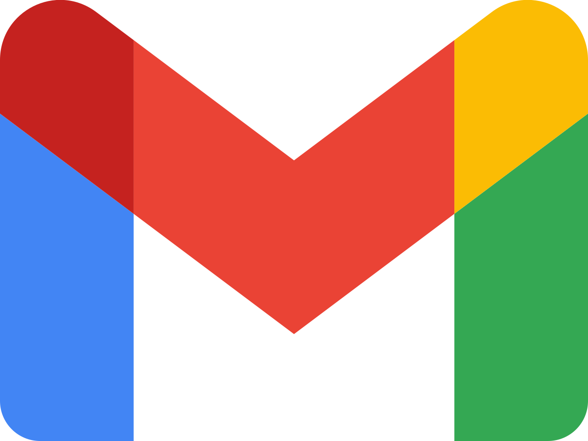
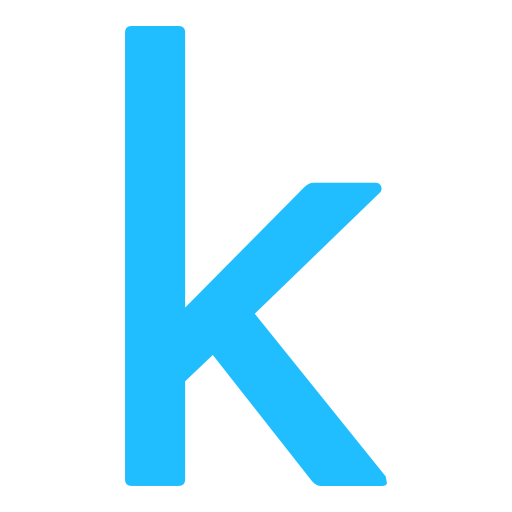
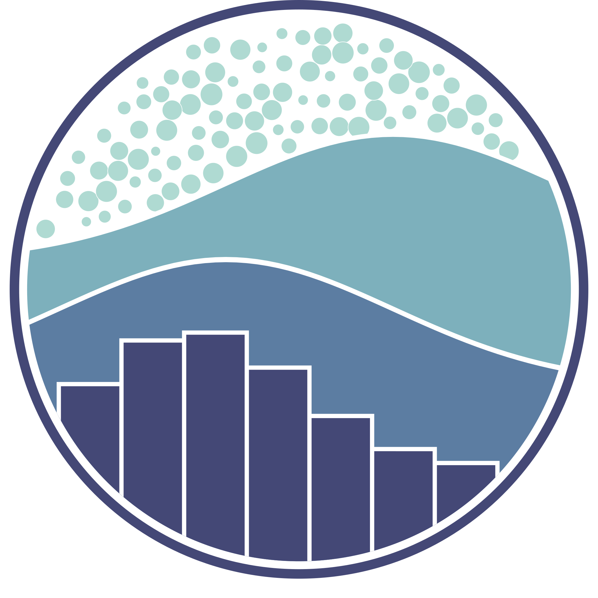

<h1 align="center">Hi, I'm Iron Wolf</h1>
<h3 align="center">Electronics & Communications Engineer Graduate | Edge AI & Embedded Systems Developer</h3>

 

   &nbsp;
   &nbsp;
   &nbsp;
   &nbsp;
  

 

<h2 align="left">Highlighted Projects</h2>

- [🌿 **Smart Greenhouse (Graduation Project)**](https://github.com/IronWolf437/Smart-Greenhouse)
- [🔥 **Fire Detection System**](https://www.kaggle.com/code/ironwolf437/fire-detection-yolov11)
- [⚡ **Ohm-App**](https://github.com/IronWolf437/ohm-app)

 

<h2 align="left">Languages:</h2>

<h2 align="left">Libraries:</h2>

    
    
    
    
    
    

<h2 align="left">Tools & hardware:</h2>

  
  
  

